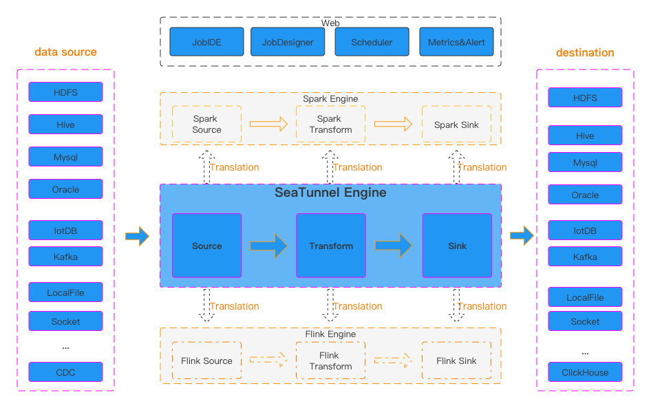
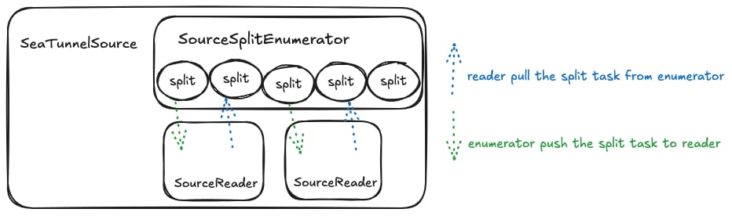
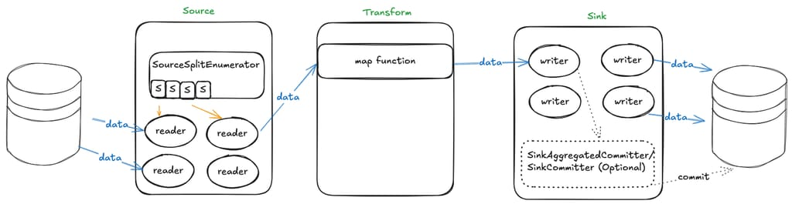
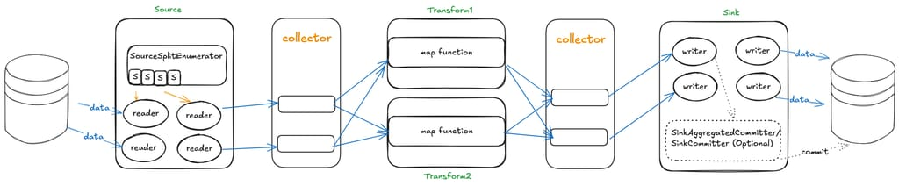

# Apache SeaTunnel API Deep Dive

## Introduction

With the development of big data technology, the demand for data integration and data stream processing is increasing. Apache SeaTunnel, as an open-source data integration framework, not only supports multiple data sources and targets but also provides flexible APIs to meet various complex business requirements.

This article will deeply analyze the Apache SeaTunnel API to help developers better understand its usage scenarios and implementation methods.

## Understanding SeaTunnel from Interface Definitions

From the official diagram, we can see that SeaTunnel defines the following types:

1. **Source API**: Used to define data input sources.
2. **Transform API**: Used to process and transform data.
3. **Sink API**: Used to define data output targets.

Three types of operators



So I want to start by looking at Apache SeaTunnel's design philosophy from the interface definitions.

## SeaTunnelSource

`SeaTunnelSource` is the interface definition for data reading. In this interface, it defines how to extract data from a data source.

```java
public interface SeaTunnelSource<T, SplitT extends SourceSplit, StateT extends Serializable>  
        extends Serializable,  
                PluginIdentifierInterface,  
                SeaTunnelPluginLifeCycle,  
                SeaTunnelJobAware {  
    /** 
    * Returns the type of current Source, whether it is [bounded batch data] or [unbounded stream data]
    */
    Boundedness getBoundedness();  
    
    /** 
    * This method will be deprecated in the future
    * Catalog will be used to represent data, allowing more metadata to describe the data
    */
    default SeaTunnelDataType<T> getProducedType() {  
        return (SeaTunnelDataType) getProducedCatalogTables().get(0).getSeaTunnelRowType();  
    }
      
    /** 
    * SeaTunnel currently supports multi-table reading, so this returns a list structure
    * Each catalog contains metadata information about the table being read
    */
    default List<CatalogTable> getProducedCatalogTables() {  
        throw new UnsupportedOperationException(  
                "getProducedCatalogTables method has not been implemented.");  
    }  

    /** 
    * Create Reader, which is the class that actually reads the data
    */ 
    SourceReader<T, SplitT> createReader(SourceReader.Context readerContext) throws Exception;  

    /**
    * These two methods are for creating/restoring SplitEnumerator
    */
    SourceSplitEnumerator<SplitT, StateT> createEnumerator(  
            SourceSplitEnumerator.Context<SplitT> enumeratorContext) throws Exception;  
    SourceSplitEnumerator<SplitT, StateT> restoreEnumerator(  
            SourceSplitEnumerator.Context<SplitT> enumeratorContext, StateT checkpointState)  
            throws Exception;  

    /**
    * These two methods are generally not modified, can be overridden if custom serialization is needed
    */
    default Serializer<SplitT> getSplitSerializer() {  
        return new DefaultSerializer<>();  
    }
    default Serializer<StateT> getEnumeratorStateSerializer() {  
        return new DefaultSerializer<>();  
    }
      
}
```

From this interface, we can see two main methods:

- `createReader`
- `createEnumerator`

The `SourceSplitEnumerator` created by the `createEnumerator` method is responsible for splitting the data extraction tasks. The `SourceReader` created by the `createReader` method will perform the actual task reading based on these split tasks.

First, let's look at the code for `SourceSplitEnumerator`.

### SourceSplitEnumerator

```java
public interface SourceSplitEnumerator<SplitT extends SourceSplit, StateT> extends AutoCloseable, CheckpointListener {

    void open();

    void run() throws Exception;
    
    @Override
    void close() throws IOException;

    void addSplitsBack(List<SplitT> splits, int subtaskId);

    int currentUnassignedSplitSize();

    void handleSplitRequest(int subtaskId);
    
    void registerReader(int subtaskId);

    StateT snapshotState(long checkpointId) throws Exception;

    default void handleSourceEvent(int subtaskId, SourceEvent sourceEvent) {}

    interface Context<SplitT extends SourceSplit> {
    
        int currentParallelism();

        Set<Integer> registeredReaders();

        void assignSplit(int subtaskId, List<SplitT> splits);

        default void assignSplit(int subtaskId, SplitT split) {
            assignSplit(subtaskId, Collections.singletonList(split));
        }

        void signalNoMoreSplits(int subtask);

        void sendEventToSourceReader(int subtaskId, SourceEvent event);

        MetricsContext getMetricsContext();

        EventListener getEventListener();
    }

}
```

The `SourceSplitEnumerator` interface defines some methods and an inner class `Context`. First, let's look at its own methods. We can see there are 3 lifecycle-related methods: `open()`, `run()`, and `close()`. These methods require connectors to handle resource creation or cleanup based on their implementations.

- `registerReader(int subtaskId)` method: `reader` actively registers with the `split enumerator`
- `handleSplitRequest(int subtaskId)`: `reader` actively requests from the `split enumerator` to get the extraction tasks it will execute.  
  (However, looking at the code implementation, this approach is less common; most of the time, the `enumerator` actively pushes tasks to `reader`)
- `addSplitsBack(List<SplitT> splits, int subtaskId)`: When a reader encounters an exception, its running tasks need to be reassigned. At this point, these tasks need to be added back to the queue for reassignment to other nodes for fault tolerance.

In the `Context` interface definition, there are two key methods:

- `assignSplit(int subtaskId, List<SplitT> splits)`: `split enumerator` actively pushes tasks to a specific `reader`
- `signalNoMoreSplits(int subtaskId)`: `split enumerator` tells a specific `reader` that no more tasks will be assigned to it.

### SourceReader

```java
public interface SourceReader<T, SplitT extends SourceSplit>
        extends AutoCloseable, CheckpointListener {

    void open() throws Exception;

    @Override
    void close() throws IOException;

    void pollNext(Collector<T> output) throws Exception;

    List<SplitT> snapshotState(long checkpointId) throws Exception;

    void addSplits(List<SplitT> splits);

    void handleNoMoreSplits();

    default void handleSourceEvent(SourceEvent sourceEvent) {}

    interface Context {

        int getIndexOfSubtask();

        Boundedness getBoundedness();

        void signalNoMoreElement();

        void sendSplitRequest();

        void sendSourceEventToEnumerator(SourceEvent sourceEvent);

        MetricsContext getMetricsContext();

        EventListener getEventListener();
    }
    
}
```

In the Reader interface definition, there is also an inner class `Context`.

Let's look at some of the main methods:

- `pollNext(Collector<T> output)`: The main method for data extraction. In this method, each connector will implement extracting data from its corresponding data source, converting it to SeaTunnel's internal data structure `SeaTunnelRow`, and then adding it to the `Collector`
- `addSplits(List<SplitT> splits)`: `reader`'s handling after receiving tasks assigned by the `split enumerator`
- `snapshotState(long checkpointId)`: This method is called during `checkpoint`, requiring the `reader` to record some state for subsequent fault tolerance

### Summary with a Diagram



Here, a `Split` represents a task for splitting data source reads. It can be a partition of a Hive table, a partition of `Kafka`, or a split of a `JDBC` query statement. In short, the core idea is to split data reading into multiple independent reading tasks that can be assigned to different `reader` instances for execution, thereby speeding up queries.

For example: In batch processing, data can be split into N parts, allowing data extraction to be executed in parallel to achieve speed improvement.

For stream processing, there are two approaches. One is to split data into limited unbounded data streams (e.g., `Kafka` splits by partition, one partition per task, each task being an unbounded data stream).

Another approach is to generate infinite bounded data streams (also using `Kafka` as an example, extracting part of the data from a partition each time, infinitely generating task definitions).

As for how many `Splits` a data reading task will ultimately be divided into and how to implement the splitting, it's up to each connector's implementation. Each connector can decide based on the actual partitions being read or parameters.

Next, let's look at the code related to `Transform`!

## SeaTunnelTransform

```java
public interface SeaTunnelTransform<T>  
        extends Serializable, PluginIdentifierInterface, SeaTunnelJobAware {  
    
    default void open() {}  
    
    default void setTypeInfo(SeaTunnelDataType<T> inputDataType) {  
        throw new UnsupportedOperationException("setTypeInfo method is not supported");  
    }  

    // Get the data structure after Transform processing
    CatalogTable getProducedCatalogTable();  
 
    // From this, we can see that Transform in SeaTunnel only supports map operations
    // Operations like Join involving multiple data sources are not supported
    T map(T row);  
  
    default void close() {}  
}
```

In `transform`, there is one key method `T map(T row)`, which performs `map` processing on an original data record to get a new data record. The structure of the new data is consistent with `getProducedCatalogTable()`.

> This code is based on version 2.3.6. The community is currently working on multi-table read/write functionality for `Transform`. Currently, only the `map` operator (one-to-one) is supported. I've seen the community also discussing whether to support the `flatMap` operator (one-to-many), which would allow data expansion operations during synchronization.

Now let's look at the `Sink` code!

## SeaTunnelSink

```java
public interface SeaTunnelSink<IN, StateT, CommitInfoT, AggregatedCommitInfoT>
        extends Serializable,
                PluginIdentifierInterface,
                SeaTunnelPluginLifeCycle,
                SeaTunnelJobAware {

    @Deprecated
    // These two methods are also marked as deprecated, will use Catalog for representation in the future
    default void setTypeInfo(SeaTunnelRowType seaTunnelRowType) {
        throw new UnsupportedOperationException("setTypeInfo method is not supported");
    }
    @Deprecated
    default SeaTunnelDataType<IN> getConsumedType() {
        throw new UnsupportedOperationException("getConsumedType method is not supported");
    }

    /**
    * Create/restore SinkWriter, Writer is the class that actually performs data writing
    */ 
    SinkWriter<IN, CommitInfoT, StateT> createWriter(SinkWriter.Context context) throws IOException;
    default SinkWriter<IN, CommitInfoT, StateT> restoreWriter(
            SinkWriter.Context context, List<StateT> states) throws IOException {
        return createWriter(context);
    }

    default Optional<Serializer<StateT>> getWriterStateSerializer() {
        return Optional.empty();
    }

    default Optional<SinkCommitter<CommitInfoT>> createCommitter() throws IOException {
        return Optional.empty();
    }

    default Optional<Serializer<CommitInfoT>> getCommitInfoSerializer() {
        return Optional.empty();
    }

    default Optional<SinkAggregatedCommitter<CommitInfoT, AggregatedCommitInfoT>
            createAggregatedCommitter() throws IOException {
        return Optional.empty();
    }

    default Optional<Serializer<AggregatedCommitInfoT>> getAggregatedCommitInfoSerializer() {
        return Optional.empty();
    }

}
```

In Sink, there are several key methods:

- `createWriter(SinkWriter.Context context)`: Create Writer instance. Similar to Source, the actual data writing is performed by the `Writer`.

- `createCommitter()`: Optional. When two-phase commit is needed, create a `SinkCommitter` to complete the two-phase commit. This approach is no longer recommended; it's recommended to use `createAggregatedCommitter()` for two-phase commit.

- `createAggregatedCommitter()`: Optional. Similar to `SinkCommitter`, used for two-phase commit during the commit phase.

  The difference is that `SinkAggregatedCommitter` runs as a single instance, not multiple instances, concentrating all commit tasks in one place for execution. So if a connector needs two-phase commit, it's recommended to use `createAggregatedCommitter()` to create it.

### SinkWriter

```java
public interface SinkWriter<T, CommitInfoT, StateT> {  

    void write(T element) throws IOException;  

    default void applySchemaChange(SchemaChangeEvent event) throws IOException {}  
    
    Optional<CommitInfoT> prepareCommit() throws IOException;  
    
    default List<StateT> snapshotState(long checkpointId) throws IOException {  
        return Collections.emptyList();  
    }  
    
    void abortPrepare();  
      
    void close() throws IOException;  

    interface Context extends Serializable {  

        int getIndexOfSubtask();  

        default int getNumberOfParallelSubtasks() {  
            return 1;  
        }  

        MetricsContext getMetricsContext();
 
        EventListener getEventListener();  
    }  
}
```

We can see that the structure of `SinkWriter` is somewhat similar to `SourceReader`. Let's look at some key methods:

- `write(T element)`: Implementation of writing to the target database when receiving upstream data;

- `applySchemaChange(SchemaChangeEvent event)`: How downstream handles when upstream data table structure changes, such as adding/removing fields, modifying field names. But this depends on the specific implementation;

- `prepareCommit()`: When two-phase commit is needed, generate information for this commit, which will be handed over to `SinkCommitter/SinkAggregatedCommitter` for two-phase commit. This method is called during `checkpoint`, meaning information is committed to the target connector only during each `checkpoint`;

- `snapshotState()`: During `checkpoint`, store some state of the `writer` for subsequent fault tolerance;

### Summary with a Diagram



When data needs to be read from a data source, `SourceSplitEnumerator` first splits the tasks, then `SourceReader` executes the split data reading tasks. During reading, raw data needs to be converted to SeaTunnel's internal `SeaTunnelRow`, then passed downstream to `Transform` for data transformation. After transformation, it's handed to `SinkWriter` to write the `SeaTunnelRow` data to the corresponding connector. If two-phase commit is needed during writing, additional `SinkCommitter` related classes need to be implemented.

## Collector

In the previous sections, we've described the functionality of `source`, `transform`, and `sink`.

But how is data passed between `source`, `transform`, and `sink`? If a `source` has multiple downstream components, how are messages distributed to all downstream components? This is where the `Collector` interface comes in.

From the data flow direction, only `source` to downstream or `transform` to downstream passes data, so we can see there are two `Collector` interface definitions, located in the `source` and `transform` packages respectively.

First, let's look at the `Collector` definition in `source`:

```java
public interface Collector<T> {  
  
    void collect(T record);  
  
    default void markSchemaChangeBeforeCheckpoint() {}  
  
    default void collect(SchemaChangeEvent event) {}  
  
    default void markSchemaChangeAfterCheckpoint() {}  
    
    Object getCheckpointLock();  
  
    default boolean isEmptyThisPollNext() {  
        return false;  
    }  
  
    default void resetEmptyThisPollNext() {}  
}
```

The `Collector` definition in `transform` is relatively simple:

```java
public interface Collector<T> {     
    void collect(T record);    
    void close();  
}
```

`Collector` decouples multiple operators. Each operator only needs to focus on how to process data, without worrying about who to send the result data to.

Updating the previous diagram (adding another Transform to show the multi-downstream scenario):



